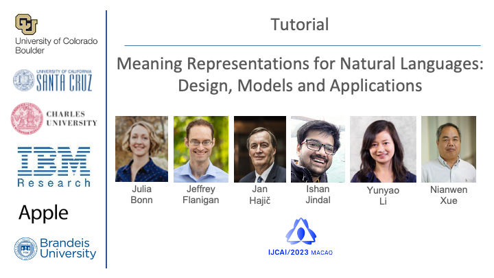
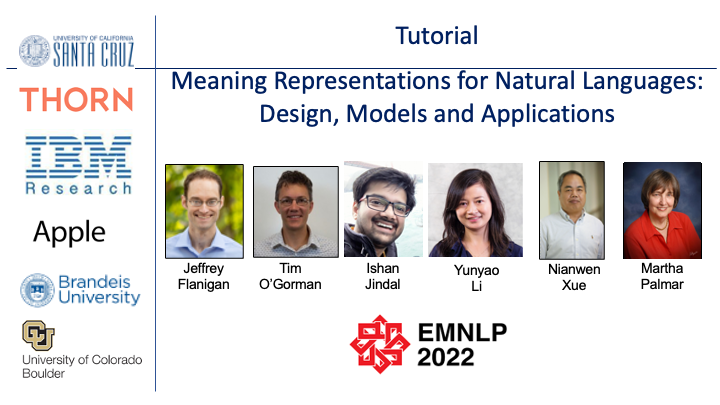
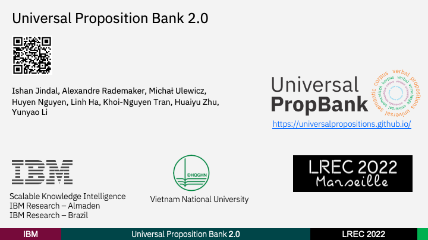

## Tutorials

### IJCAI 2023
- IJCAI 2023 Tutorial on "[Meaning Representations for Natural Languages: Design, Models and Applications.](https://umr4nlp.github.io/web/IJCAI_2023_Tutorial_Meaning_Representations.pdf)"
- Presenters: [Julia Bonn](https://www.colorado.edu/ics/julia-r-bonn), [Jan Hajic](https://ufal.mff.cuni.cz/jan-hajic), [Jeffrey Flanigan](https://jflanigan.github.io/), [Ishan Jindal](https://ijindal.github.io/), [Yunyao Li](https://yunyaoli.github.io/), [Nianwen Xue](https://www.cs.brandeis.edu/~xuen/)

   

- Topic-wise slide deck
    - Part 1: Introduction
        - Introduction to Meaning Representations and Tutorial Outline [Link](../../pdf/IJCAI-23_MR-Tutorial_P1-Introduction.pdf)
    - Part 2: Design
        - Abstract Meaning Representation [Link](../../pdf/IJCAI-23_MR-Tutorial_P2-AMR-Bonn.pdf)
        - Common Meaning Representation [Link](../../pdf/IJCAI-23_MR-Tutorial_P2-CMR-Hajic.pdf)
        - Uniform Meaning Representation [Link](../../pdf/IJCAI-23_MR-Tutorial_P2-UMR-Xue.pdf)
     - Part 3: Modeling
        - Modeling Semantic Role Labeling [Link](../../pdf/IJCAI-23_MR-Tutorial_P3-SRL-Ishan.pdf)
        - Modeling Abstract Meaning Representation [Link](../../pdf/IJCAI-23_MR-Tutorial_P3-Jeff.pdf)
     - Part 4: Applications
        - Various applications of different meaning representations [Link](../../pdf/2023_IJCAI_MR_applications.pdf)
     - Part 5: Future work
        - What's next and open challenges [Link](../../pdf/IJCAI-MR-tutorial-5-open-questions-Xue-v02.pdf)
       

### EMNLP 2022
- EMNLP 2022 Tutorial on "[Meaning Representations for Natural Languages: Design, Models and Applications.](https://aclanthology.org/2022.emnlp-tutorials.1/)" [Jeffrey Flanigan](https://jflanigan.github.io/), [Tim O’Gorman](https://timjogorman.github.io/), [Ishan Jindal](https://ijindal.github.io/), [Yunyao Li](https://yunyaoli.github.io/),  [Martha Palmer](https://www.colorado.edu/faculty/palmer-martha), [Nianwen Xue](https://www.cs.brandeis.edu/~xuen/)
- [Video](https://underline.io/events/342/posters/12864/poster/67463-meaning-representations-for-natural-languages-design-models-and-applications), [Slide deck](https://drive.google.com/file/d/1LS6q5VRsERD7nWX4vlQVmoz0ksfAWPL7/view?usp=sharing)

<!-- 
 -->
 

   

---

## Presentations

- UP2.0 Introduction at LREC 2022. 
- [Video](https://s3.eu-west-2.wasabisys.com/lrec2022/sessions/1089.mp4), [Slide deck](https://github.com/UniversalPropositions/universalpropositions.github.io/blob/main/pdf/2022_06_20_UP2.0.pdf)
<!-- 

 -->

   

<!-- ## Event Submissions
- [Shared-task proposal in submission] Multilingual and Cross-lingual Semantic Role Labeling and its Applications in NLP. [Ishan Jindal](https://ijindal.github.io/), [Lonneke van der Plas](https://sites.google.com/site/lonnekenlp/), [Skatje Myers](http://ska.tjemye.rs/), [Alexandre Rademaker](https://arademaker.github.io/), Kathryn Conger, [Sameer Pradhan](https://cemantix.org/), [Martha Palmer](https://www.colorado.edu/faculty/palmer-martha)
 -->


